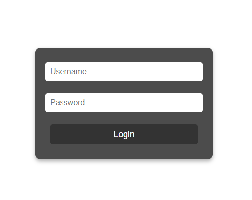
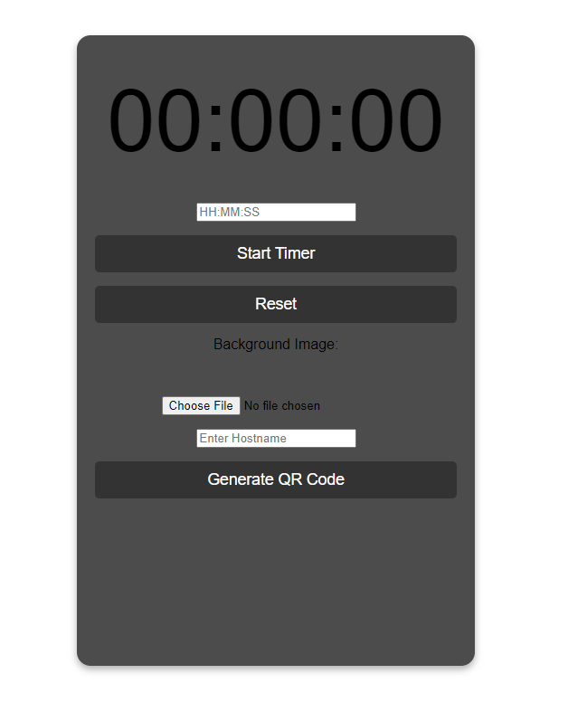

# TabeTopTimer

A web-based timer application designed for tabletop tournaments. This project includes both a user-facing timer display and an admin panel for setting and controlling the timer. The admin panel is secured behind a login to ensure only authorized users can modify the timer settings and background image.

## Features

- **Timer Display**: A large, easy-to-read timer display for Warhammer 40K games.
- **Admin Panel**: A separate admin page for setting the countdown timer, uploading background images, and controlling the timer.
- **Background Image Upload**: Allows the admin to upload a custom background image for the timer display.
- **Responsive Design**: Optimized for both desktop and mobile devices.
- **Full-Screen Mode**: Option to switch the timer display to full-screen mode for better visibility during games.
- **Real-Time Updates**: Timer updates are synced in real-time across all connected clients using Socket.io.

## Installation

To run this project locally, follow these steps:

1. **Clone the repository**:
    ```bash
    git clone https://github.com/mattman0123/TabeTopTimer.git
    cd TabeTopTimer
    ```

2. **Install dependencies**:
    ```bash
    npm install
    ```

3. **Start the server**:
    ```bash
    npm start
    ```

4. **Access the application**:
    - Open your browser and navigate to `http://localhost:3000` to see the timer display.
    - Navigate to `http://localhost:3000/login` to access the admin panel.

## Technologies Used

- **Node.js**: JavaScript runtime environment for server-side code.
- **Express**: Web framework for Node.js.
- **Socket.io**: Real-time, bidirectional event-based communication.
- **Multer**: Middleware for handling `multipart/form-data` for file uploads.
- **HTML/CSS**: Markup and styling for the frontend.
- **JavaScript**: Client-side scripting.

## Screenshots

### Timer Display


### Login Page


### Admin Panel


### Admin Panel with Timer


## Usage

- **Timer Display**: Displays the countdown timer for players to keep track of their game time.
- **Admin Panel**: Allows authorized users to set the countdown time, start/pause/reset the timer, and upload custom background images.

## Contributing

Contributions are welcome! Please fork the repository and submit a pull request for any features, improvements, or bug fixes.

## License

This project is licensed under the MIT License.

